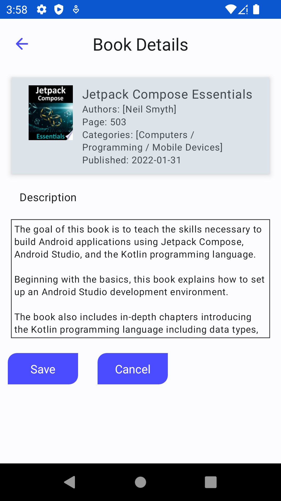

# Reading Trackers (work-in-progress 👷🔧️⛏)

Reading Trackers is an android application built with Jetpack Compose. It uses the Google Books API for book data. In the application, you can search for books, view book information, review books and track your reading status.

## Tech and Libraries

- [Kotlin coroutines](https://developer.android.com/kotlin/coroutines)
- [Dependency injection with Hilt](https://developer.android.com/training/dependency-injection/hilt-android)
- [Retrofit2 & OkHttp3](https://square.github.io/retrofit/)
- [ViewModel](https://developer.android.com/topic/libraries/architecture/viewmodel)
- [Jetpack Navigation](https://developer.android.com/guide/navigation/)
- [Gson](https://github.com/google/gson)
- Firebase Auth and Firestore

## Screenshots
<table>
  <tr>
     <td>Splash Screen</td>
     <td>Register</td>
     <td>Login</td>
  </tr>
  <tr>
     <td></td>
     <td></td>
     <td></td>
  </tr>
 </table>

<table>
  <tr>
     <td>Home Screen</td>
     <td>Search Screen</td>
     <td>Details Screen</td>
  </tr>
  <tr>
     <td></td>
     <td></td>
     <td></td>
  </tr>
 </table>

 <table>
  <tr>
     <td>Update Screen</td>
     <td>Stats Mention</td>
  </tr>
  <tr>
     <td></td>
     <td></td>
  </tr>
 </table>
